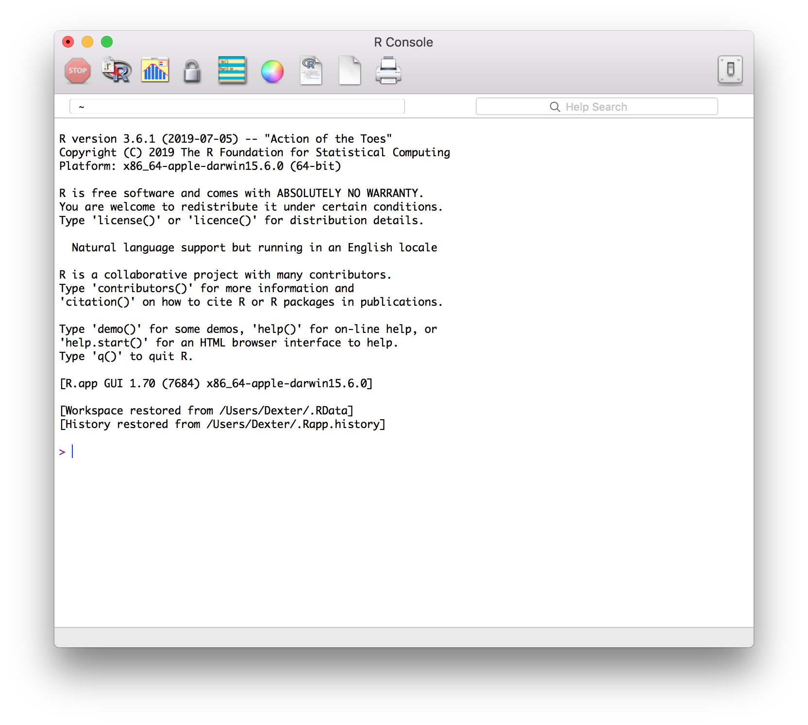

# schatz
`schatz` is a script in the R programming language for downloading images of libretti from the [Schatz Collection](https://www.loc.gov/collections/albert-schatz/) at the Library of Congress. The script is intended to be usable by those with little or no experience with R or programming, and these instructions are written for that audience.

## Download R

[R](https://www.r-project.org) is a popular and widely used interactive programming language with an  emphasis on statistical and data analysis and graphical represntation of the results. It is free and works on MacOS, Windows, and Linux.

Because R is an interactive language, you will need to download R and run the schatz.R script from the R console. However, this is not difficult to do, and the steps are straigtforward.

To download R, go to [this page](https://cran.r-project.org/mirrors.html) and select a download mirror, typically a site near you. For example, if you lie in the United Kingdom, you might choose the site at [Imperial College London](https://cran.ma.imperial.ac.uk). Click the link for your operating system (Linux, MacOS, or Windows). If your operating system is reasonably up-to-date, you can probably download the most recent version of R (3.6.1 as of this writing). The instructions for installation will vary by platform. On the Mac, you can download `R-3.6.1.pkg` (or an older version if necessary). When the file is downloaded, simply double-click on it and you'll be taken taken through the installation process.

## Download the `schatz` script

The current version of the script `schatz.R` is hosted on GitHub here:

https://github.com/dexedge/schatz

To download, click on the "Clone or download" button at the upper right and choose "Download ZIP". You'll probably want to create a special directory (folder) on your computer for the `schatz.R` script, and this may also be a convenient place for downloading the libretto images.

## Running the `schatz` script

Start R. The R console will open. On the Mac it looks like this:

