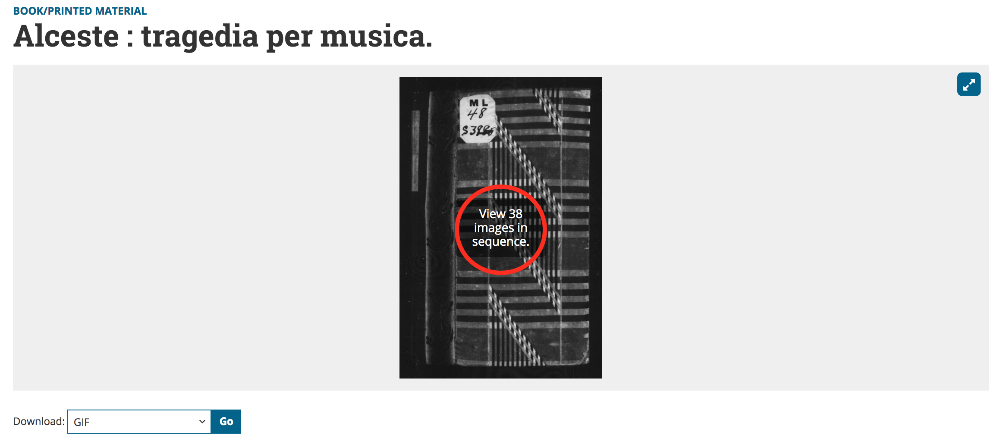

# schatz
`schatz` is a script in the R programming language for downloading images of libretti from the [Schatz Collection](https://www.loc.gov/collections/albert-schatz/) at the Library of Congress. The script is intended to be usable by those with little or no experience with R or programming, and these instructions are written for that audience.

## Download R

[R](https://www.r-project.org) is a popular and widely used interactive programming language with an  emphasis on statistical and data analysis and graphical represntation of the results. It is free and works on MacOS, Windows, and Linux.

Because R is an interactive language, you will need to download R and run the schatz.R script from the R console. However, this is not difficult to do, and the steps are straightforward.

To download R, go to [this page](https://cran.r-project.org/mirrors.html) and select a download mirror, typically a site near you. For example, if you live in the United Kingdom, you might choose the site at [Imperial College London](https://cran.ma.imperial.ac.uk). Click the link for your operating system (Linux, MacOS, or Windows). If your operating system is reasonably up-to-date, you can probably download the most recent version of R (3.6.1 as of this writing). The instructions for installation will vary by platform. On the Mac, you can download `R-3.6.1.pkg` (or an older version if necessary). When the file is downloaded, simply double-click on it and you'll be taken taken through the installation process.

## Download the `schatz` script

The current version of the script `schatz.R` is hosted on GitHub here:

https://github.com/dexedge/schatz

To download, click on the "Clone or download" button at the upper right and choose "Download ZIP". You may want to create a special directory (folder) on your computer for the `schatz.R` script, and this may also be a convenient place for downloading the libretto images.

## Running the `schatz` script

Start R. The R console will open. On the Mac it looks like this:

One easy way to run the `schatz` script (recommended if you're new to working with R) is to click the icon with the "R" logo (shown by the red arrow above), navigate to the directory (folder) where you've saved the script, select it, and (on the Mac) click "Open". The script will begin to run.

If you are running the script for the first time, it will download two small add-on packages that the script requires: `stringr` (which has functions  used to construct the URLs for downloading the individual images) and `svDialogs` (used for user input). These should take only a few seconds to download and install, and this will happen only the first time you run the script.

The script will now take you through a short series of questions. The first will ask for the URL of the *thumbnail gallery* of the libretto you want to download. It is important to use the correct URL here, as the Schatz Collection uses different types of URLs for different viewa. This is easiest to show with an example.

Suppose you want to download the original 1767 Viennese libretto for Gluck's *Alceste*. When you find it in the Schatz Collection and open the main record, the URL will look like this:

https://www.loc.gov/item/2010664635/

However, this is **not** the URL needed for the download script. To find the URL needed for the download script, click on "View 38 images in sequence":

This will take you to the thumbnail gallery for the entire libretto. It is the URL for *this* page that you need for the download script; for *Alceste* it is:

https://www.loc.gov/resource/musschatz.18018.0?st=gallery

The script needs the number from this URL (18018, which it will automatically extract) to build individual URLs for downloading each image.

Note that each box for user input in the `schatz` script comes with a default value. For the URL, it is:

https://www.loc.gov/resource/musschatz.16980.0?st=gallery

the libretto for the premiere production of Mozart's *Le nozze di Figaro* in Vienna in 1786. You can, of course, change this to the URL for whatever you're trying to download.

The script will now ask you for the numbers of the first and last images you want to download. The default for the first image is `1`, so you don't need to enter anything here if you're trying to download the complete libretto. You'll then be asked for the number of the last image you want to download; if you're downloading the complete libretto, enter its highest image number (`38` for *Alceste*). 

Note that the `schatz` script does very little error checking. If you put in a number higher than the actual last image for a particular libretto, such as `100` for *Alcest*, the script will simply halt with an error as soon as it tries to load image `39` (which doesn't exist).

The script will next open a familiar dialogue asking you to navigate to the folder where you want to store the downloaded images, and it will then ask for the prefix you'd like to use for the filenames of the images, for example `alceste-`. (The default is `image-`.)

## Limitations

The `schatz` script will try to download the entire range of images that you've requested. Sometimes this will work without a hitch, and you'll acquire (for example) all 38 images of *Alceste* in just a few seconds. However, the LOC server sometimes becomes overtaxed, and the script may download, say, 10 images, and the next request will "hang". After an interval of time with no response, the `schatz` script will halt with an error. 

I'm currently investigating ways to deal with this situation. However, if you need to rerun the script, you can start with the first images that failed to download; you don't need to start over again from the beginning of the libretto.

Please feel free to contact me with questions, bugs, or suggestions:

dexedge at gmail dot com

